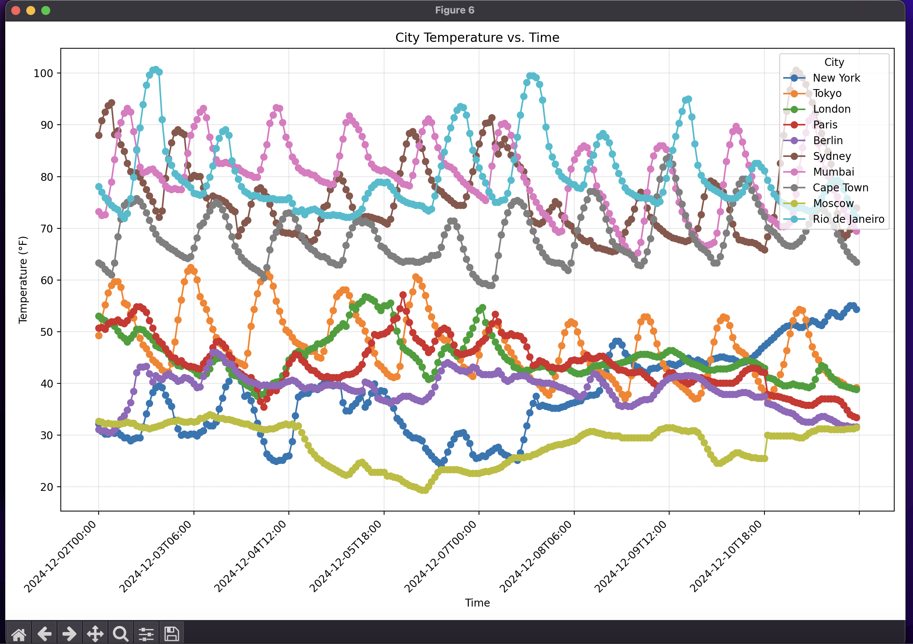

# Weather Data Scraper and API Service

## Introduction

This project serves Cities Weather Data using Open Meteo APIs. The architecture combines data processing capabilities with visualization features, all exposed through a user-friendly REST API interface.

The core functionality encompasses three main areas:
1. A data collection pipelines using multiple scripts that retrieves and processes weather information across multiple cities
    - It's capable to call External API to fetch Latitude and Longitude for list of given cities
2. An advanced visualization system that transforms raw data into meaningful graphical insights
3. A performant FastAPI application that provides programmatic access to both the data and visualizations

Graphs and Weather Data is hosted here using (FastAPI) : https://weather-city-app-b7e9bff0dd3c.herokuapp.com/

**NOTE**: The development uses **OPEN-METEO API Hourly Weather Data**

## Setup Guide

### Requirements

Before beginning the installation process, ensure your environment meets these prerequisites:
- Python 3.10 or newer
- Package management through `pip`

### Installation Process

Begin by cloning the repository to your local machine:

```bash
git clone https://github.com/namanvats/weather_scrapper_citywise.git
Go to root directory of project (check if requirements.txt is existing)
```

Next, create and activate a virtual environment to isolate your project dependencies:

For Linux/Mac users:
```bash
python -m venv venv
source venv/bin/activate
```

For Windows users:
```bash
python -m venv venv
venv\Scripts\activate
```

Install all necessary dependencies:
```bash
pip install -r requirements.txt
```

### Environment Configuration

The system requires specific environment variables for API integration:

- `NINJAS_API_KEY`: Your authentication key for the Ninjas Geocoding API, it's required to support external API call to fetch latitude and longitude in case it's not provided

Set this variable in your environment:
```bash
export NINJAS_API_KEY="your_api_key"
```

## Core Components

### Weather Scraper (`weather_scrap.py`)

This script serves as the main entry point for data collection and processing. It performs two primary functions:

1. Data Collection: Fetches weather information either for predefined cities or user-specified locations
2. Data Processing: Transforms raw data into organized CSV files and generates insightful visualizations

Note : This script is capable to call External APIs like: ninjas geo apis

To run the script:

For default city list:
```bash
python weather_scrap.py
```

For specific cities:
```bash
python weather_scrap.py "New York" "London"
```

### API Service (`app.py`)

The FastAPI application provides a RESTful interface to access the processed data and visualizations.

To launch the API server:
```bash
uvicorn app:app --reload --host 0.0.0.0 --port 8000
```

This makes the service available at `http://127.0.0.1:8000`

## API Documentation

### Root Endpoint

**Endpoint**: `/`  
**Method**: GET  
**Description**: Provides a directory of all available endpoints  
**Response Format**:
```json
{
  "weather_data_csv": "/data?type=weather",
  "highest_temp_csv": "/data?type=highest_temp",
  "lowest_humidity_csv": "/data?type=lowest_humidity",
  "city_temperature_time_graph": "/graphs?type=city_temperature_time",
  "highest_temperature_time_graph": "/graphs?type=highest_temperature_time",
  "lowest_humidity_time_graph": "/graphs?type=lowest_humidity_time",
  "temperature_city_graph": "/graphs?type=temperature_city",
  "temperature_wind_speed_graph": "/graphs?type=temperature_wind_speed",
  "wind_speed_city_graph": "/graphs?type=wind_speed_city"
}
```

### Data Endpoints

#### CSV Data Retrieval

**Base Deployed URL**: https://weather-city-app-b7e9bff0dd3c.herokuapp.com/  
**Endpoint**: `/data`  
**Method**: GET  
**Parameters**:
- `type` (required): Specifies the CSV file type
  - Available options: `weather`, `highest_temp`, `lowest_humidity`

**Example Usage**:
```bash
# Fetch general weather data
curl "http://127.0.0.1:8000/data?type=weather"

or 

Deployed: https://weather-city-app-b7e9bff0dd3c.herokuapp.com/data?type=weather

# Fetch highest temperature records
curl "http://127.0.0.1:8000/data?type=highest_temp"

or 

Deployed: https://weather-city-app-b7e9bff0dd3c.herokuapp.com/data?type=highest_temp
```

### Visualization Endpoints

#### Graph Generation

**Endpoint**: `/graphs`  
**Method**: GET  
**Parameters**:
- `type` (required): Specifies the graph type
  - Available options: `city_temperature_time`, `highest_temperature_time`, `lowest_humidity_time`, `temperature_city`, `temperature_wind_speed`, `wind_speed_city`
- `download` (optional): Boolean flag for download behavior
  - Default: `false` , Displays Graph in Browser
  - When `true`: Forces file download instead of browser display

**Example Usage**:
```bash
# View temperature trends
curl "http://127.0.0.1:8000/graphs?type=city_temperature_time"

# Download wind speed analysis
curl "http://127.0.0.1:8000/graphs?type=temperature_wind_speed&download=true"
```

If required you can host it locally or use deployed URL to fetch the data and graphs directly 

## Data Organization

### CSV Output Files

The system generates three primary CSV files in the `Data` directory:

1. `weather_data.csv`: Comprehensive weather metrics across all monitored cities
2. `highest_temp_cities.csv`: Temperature maxima tracked by city and time interval
3. `lowest_humidity_cities.csv`: Humidity minima tracked by city and time interval

### Visualization Output Files

The system produces six distinct visualization files in the `Graphs` directory:

1. `city_temperature_vs_time_all.png`: Temporal temperature patterns across cities
2. `highest_temperature_over_time.png`: Maximum temperature trends
3. `lowest_humidity_over_time.png`: Minimum humidity patterns
4. `temperature_by_city.png`: City-wise temperature distribution analysis
5. `temperature_vs_wind_speed.png`: Temperature-wind speed correlation study
6. `wind_speed_by_city.png`: City-wise wind speed distribution analysis

### Screenshots

Here are some visual examples of the application in action:

#### API Interface

*The root endpoint showing all available API routes*

### Data Visualization

*Temperature trends across different cities over time*


*Distribution of temperature across monitored cities*

### Data Processing

*Sample of processed weather data in CSV format*

--- 
Feel Free to reach out to : way2naman13@gmail.com (in case of any issues)